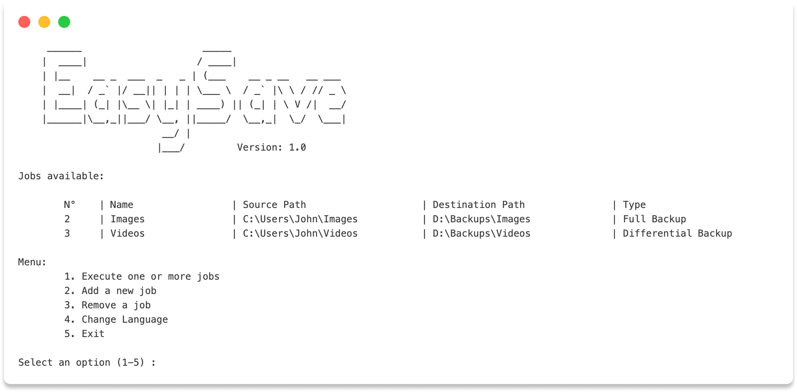

<section align="center">
  <h1>
    💾 EasySave
  </h1>

  <a href="./LICENSE">  
    
  </a>

  <p>
    The <strong>EasySave</strong> project by ProSoft aims to develop a versatile and user-friendly backup software.
  </p>

  <div>
    <a href="https://learn.microsoft.com/en-us/dotnet/csharp/" target="_blank">
      
    </a>
    <a href="https://learn.microsoft.com/en-us/dotnet/whats-new/dotnet-9" target="_blank">
      
    </a>
    <a href="https://www.sonarsource.com/" target="_blank">
      
    </a>
  </div>
</section>

</br>

## 📚 Overview

</br>

<div align="center">
  
</div>

</br>

<p align="justify">
  <strong>EasySave 1.0</strong> enables users to create and execute up to <strong>five backup tasks</strong>, supporting both <strong>full and differential backups</strong>.
  It supports <strong>English</strong> and <strong>French</strong> and can back up files from local disks, external drives, and network drives. The application also features real-time logging, storing detailed backup information in JSON files.
</p>

</br>

<div align="center">
  <table>
    <tr>
      <td>💾 Backup tasks</td>
      <td>📂 Full and differential backups</td>
      <td>💻 Command-line input</td>
    </tr>
    <tr>
      <td>🔄 Follows best practices</td>
      <td>🌐 English and French support</td>
      <td>📈 Real-time logging</td>
    </tr>
    <tr>
      <td>🖥️ Multiplatform</td>
      <td>✅ Tested</td>
      <td>📚 Documented</td>
    </tr>
  </table>
</div>

</br>

## 📖 Documentation

Comprehensive user documentation is available to help you get started and understand the application's features.

**User Guide**: Learn how EasySave efficiently.

**[Read the Full Documentation](./USER-GUIDE.md)**

</br>


## 📦 Installation

Ensure **.NET 9** is installed before running the application..  
The **EasySave** solution consists of **multiple projects**:


``` python
EasySave/                # Main solution
│
├── src/                 # Directory for source code Projects
│   ├── EasySave/        # Core application
│   └── Logger/          # Logging module
│
└── test/                # Directory for unit tests Projects
    ├── EasySave.Tests/  # Unit tests for EasySave
    └── Logger.Tests/    # Unit tests for Logger
```

</br>


## 🚀 Getting Started

To start the application, simply run the **EasySave** project:

```python
dotnet
├── build                # Builds the application
├── run                  # Runs the main project
└── test                 # Executes unit tests
```

</br>


<div align="center">
  <table style="width: 100%;">
    <thead>
      <tr>
        <th>Category</th>
        <th>Library</th>
        <th>Description</th>
      </tr>
    </thead>
    <tbody>
      <tr>
        <td>.NET Development</td>
        <td>
          <ul style="list-style-type: none; padding: 0;">
            <li></li>
            <li></li>
            <li></li>
          </ul>
        </td>
        <td>Popular IDEs for .NET development.</td>
      </tr>
      <tr>
        <td>Software Testing</td>
        <td>
          <ul style="list-style-type: none; padding: 0;">
            <li></li>
            <li></li>
            <li></li>
          </ul>
        </td>
        <td>Unit testing, coverage, and code quality tools.</td>
      </tr>
      <tr>
        <td>Documentation</td>
        <td>
          <ul style="list-style-type: none; padding: 0;">
            <li></li>
          </ul>
        </td>
        <td>Generates documentation from source code.</td>
      </tr>
      <tr>
        <td>Multiplatform</td>
        <td>
          <ul style="list-style-type: none; padding: 0;">
            <li></li>
            <li></li>
            <li></li>
          </ul>
        </td>
        <td>Supports multiple operating systems.</td>
      </tr>
      <tr>
        <td>Management</td>
        <td>
          <ul style="list-style-type: none; padding: 0;">
            <li></li>
            <li></li>
          </ul>
        </td>
        <td>Version control and project management.</td>
      </tr>
    </tbody>
  </table>
</div>

</br>

## ✍️ Authors 

- [Florent **MAILLARD-SALIN**](mailto:florent.maillardsalin@viacesi.fr)
- [Brieuc **OLIVIERI**](mailto:brieuc.olivieri@viacesi.fr)
- [Lilian **BAUDRY**](mailto:lilian.baudry@viacesi.fr)

</br>

<p align="center">
  2025 © <strong>ProSoft</strong>™. Tous droits réservés.
</p>